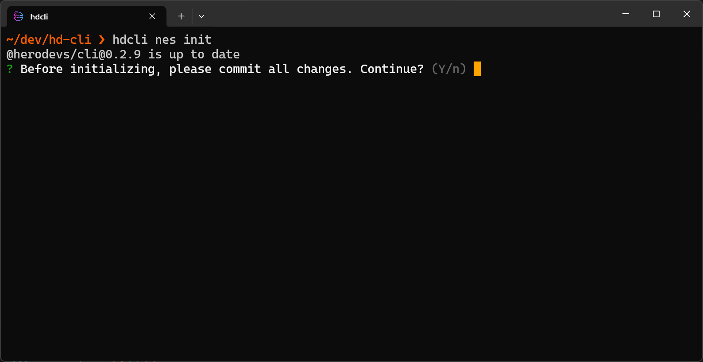
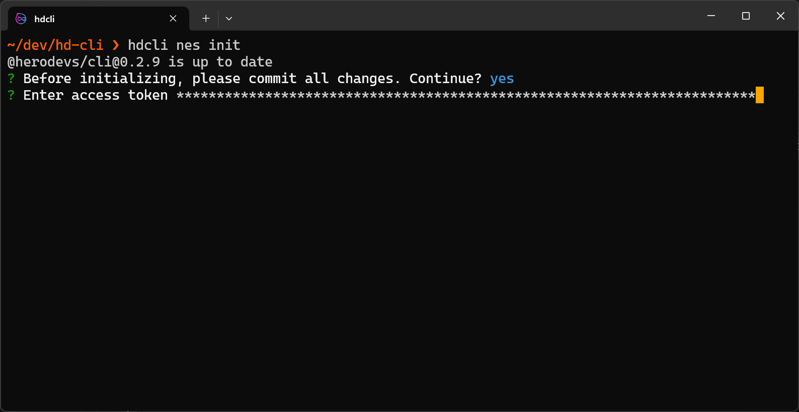
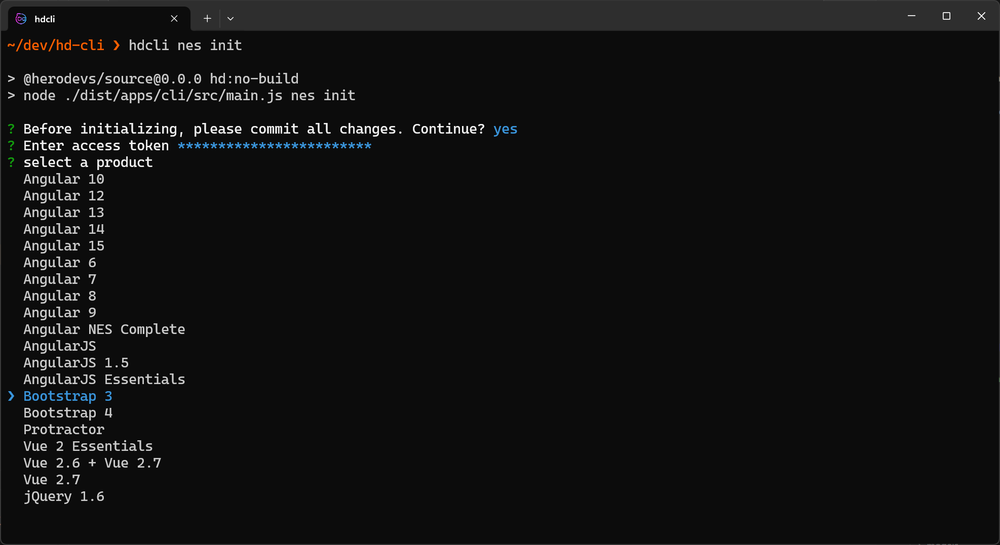
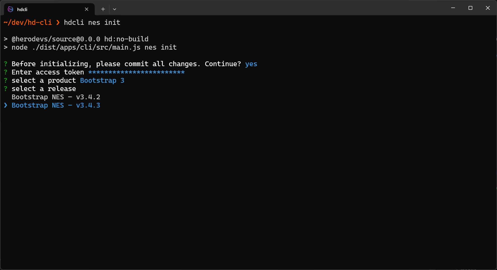
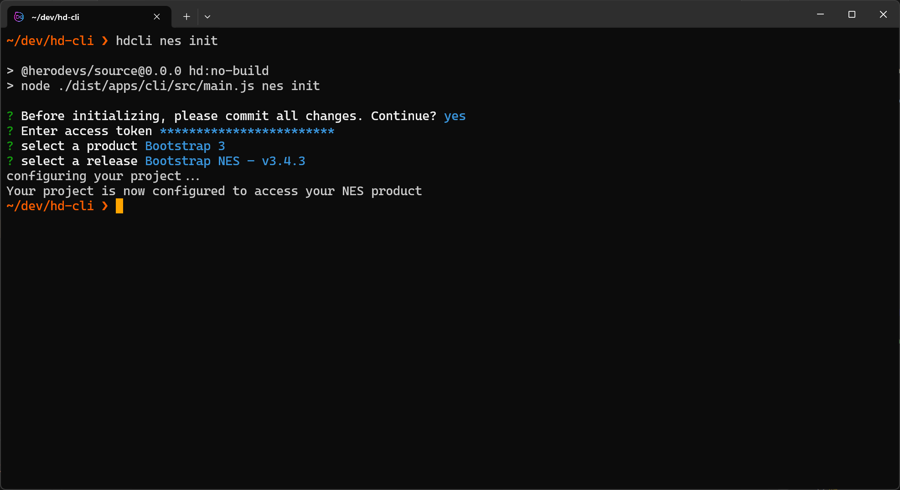

# NES Init

Configure a project to use a [Never-Ending Support](https://www.herodevs.com/support#NES-Products) product.

## Installation

Follow the instructions [here](installation-and-running.md) to install the HeroDevs CLI.

## Running the command

```
hdcli nes init
```

## Steps/procedure

Confirm all changes have been committed to source control/git.



Enter your access token.



Select your product.



Select your version.



CONGRATULATIONS! Your product is now configured to use a NES product.


